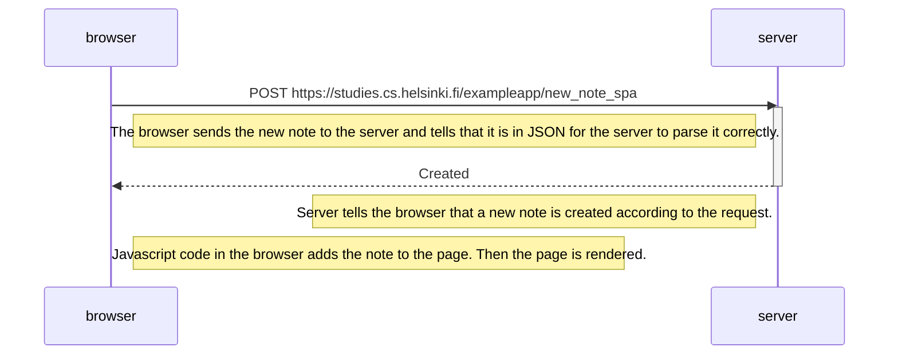

```mermaid
sequenceDiagram
    participant browser
    participant server
    
    browser->>server: POST https://studies.cs.helsinki.fi/exampleapp/new_note_spa
    activate server

    Note right of browser: The browser sends the new note to the server and tells that it is in JSON for the server to parse it correctly.

    server-->>browser: Created
    deactivate server

    Note left of server: Server tells the browser that a new note is created according to the request. 
    Note right of browser: Javascript code in the browser adds the note to the page. Then the page is rendered.
```